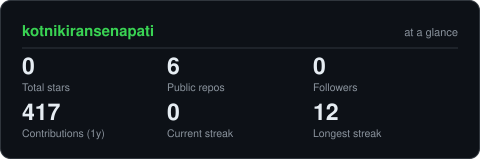
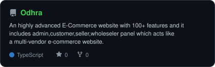
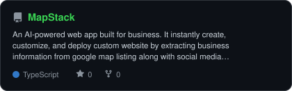
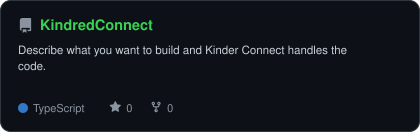

<div align="center">

<!-- PORTRAIT - generated by scripts/dotify.py from assets/jacket.png.
     Colour mode, so one file serves both GitHub themes. Regenerate with:
       python scripts/dotify.py assets/jacket.png -o assets/portrait \
        --cols 100 --equalize --detail 0.5 --color -->


<br>

<!-- NAME / TAGLINE - animated typing -->

<a href="https://github.com/kotnikiransenapati">
  
</a>

<br>

<!-- SOCIALS -->

<a href="https://linkedin.com/in/kotnikiransenapati"></a> <a href="mailto:kotnikiransenapati@gmail.com"></a> <a href="#"></a> <a href="https://codeforces.com/profile/kotnikiransenapati"></a> <a href="https://leetcode.com/u/EIta2FILy3/"></a> <a href="https://www.codechef.com/users/kkiransenapati"></a>


</div>

---

## `~/` whoami

```console
$ cat about.txt
```

Hi, I'm **Kiran Senapati**. I build full-stack web applications, explore AI & machine learning,
and solve problems through competitive programming.

* Currently building **[Odhra](https://odhraodhra1.lovable.app)**, **[MapStack](https://mapstackbykks.lovable.app)** and **[KindredConnect](https://kindred-flame-lab.lovable.app)**
* Portfolio: **Coming Soon**
* Learning **AI & Machine Learning + Full-Stack Web Development**
* Fun fact: **I enjoy turning ideas into working products and solving challenging problems through code.**

<br>

<div align="center">

## `~/` toolbox


</div>

---

<div align="center">

## `~/` skill radar

<table>
<tr>
<td width="50%" align="center" valign="middle">

<!-- Self-rated radar - edit assets/skills.json, the workflow redraws it -->

<picture>
  <source media="(prefers-color-scheme: dark)"  srcset="assets/radar-dark.svg">
  <source media="(prefers-color-scheme: light)" srcset="assets/radar-light.svg">
  
</picture>

</td>
<td width="50%" align="center" valign="middle">

<!-- Live radar built from real language byte counts across your repos -->

<picture>
  <source media="(prefers-color-scheme: dark)"  srcset="assets/radar-langs-dark.svg">
  <source media="(prefers-color-scheme: light)" srcset="assets/radar-langs-light.svg">
  
</picture>

</td>
</tr>
</table>

</div>

---

<div align="center">

## `~/` contribution calendar

<!-- 3D isometric calendar, regenerated every 6h by .github/workflows/metrics.yml -->


<br><br>

<!-- Snake eats the contribution graph - .github/workflows/snake.yml -->

<picture>
  <source media="(prefers-color-scheme: dark)"  srcset="https://raw.githubusercontent.com/kotnikiransenapati/kotnikiransenapati/output/snake-dark.svg">
  <source media="(prefers-color-scheme: light)" srcset="https://raw.githubusercontent.com/kotnikiransenapati/kotnikiransenapati/output/snake.svg">
  
</picture>

</div>

---

<div align="center">

## `~/` the numbers

<!-- Generated by scripts/cards.py into this repo. Deliberately NOT
     github-readme-stats / streak-stats / github-profile-trophy: those are
     shared public instances that go down and take the whole section with them. -->

<picture>
  <source media="(prefers-color-scheme: dark)"  srcset="assets/card-stats-dark.svg">
  <source media="(prefers-color-scheme: light)" srcset="assets/card-stats-light.svg">
  
</picture>

<br>


<br><br>


</div>

---

<div align="center">

## `~/` selected work

<!-- Cards generated by scripts/cards.py from assets/projects.json.
     Stars, forks and language are pulled live from the API on every run. -->

<table>
<tr>
<td width="50%">
  <a href="https://github.com/kotnikiransenapati/Odhra">
    <picture>
      <source media="(prefers-color-scheme: dark)"  srcset="assets/card-Odhra-dark.svg">
      <source media="(prefers-color-scheme: light)" srcset="assets/card-Odhra-light.svg">
      
    </picture>
  </a>
</td>
<td width="50%">
  <a href="https://github.com/kotnikiransenapati/MapStack">
    <picture>
      <source media="(prefers-color-scheme: dark)"  srcset="assets/card-MapStack-dark.svg">
      <source media="(prefers-color-scheme: light)" srcset="assets/card-MapStack-light.svg">
      
    </picture>
  </a>
</td>
</tr>
<tr>
<td width="50%">
  <a href="https://github.com/kotnikiransenapati/KindredConnect">
    <picture>
      <source media="(prefers-color-scheme: dark)"  srcset="assets/card-KindredConnect-dark.svg">
      <source media="(prefers-color-scheme: light)" srcset="assets/card-KindredConnect-light.svg">
      
    </picture>
  </a>
</td>
<td width="50%">
  <a href="#">
    <picture>
      <source media="(prefers-color-scheme: dark)"  srcset="assets/card-Portfolio-dark.svg">
      <source media="(prefers-color-scheme: light)" srcset="assets/card-Portfolio-light.svg">
      
    </picture>
  </a>
</td>
</tr>
</table>

<sub>

| project                                                     | live                                                                   | stack                   |
| ----------------------------------------------------------- | ---------------------------------------------------------------------- | ----------------------- |
| **[Odhra](https://odhraodhra1.lovable.app)**                | [odhraodhra1.lovable.app](https://odhraodhra1.lovable.app)             | `React` `Full-Stack`    |
| **[MapStack](https://mapstackbykks.lovable.app)**           | [mapstackbykks.lovable.app](https://mapstackbykks.lovable.app)         | `TypeScript` `Web`      |
| **[KindredConnect](https://kindred-flame-lab.lovable.app)** | [kindred-flame-lab.lovable.app](https://kindred-flame-lab.lovable.app) | `JavaScript` `Frontend` |
| **[Portfolio](#)**                                          | Coming Soon                                                            | `In Development`        |

</sub>

</div>

---

<div align="center">

<sub>`01110100 01101000 01100001 01101110 01101011 01110011 00100000 01100110 01101111 01110010 00100000 01110011 01100011 01110010 01101111 01101100 01101100 01101001 01101110 01100111`</sub>

</div>
